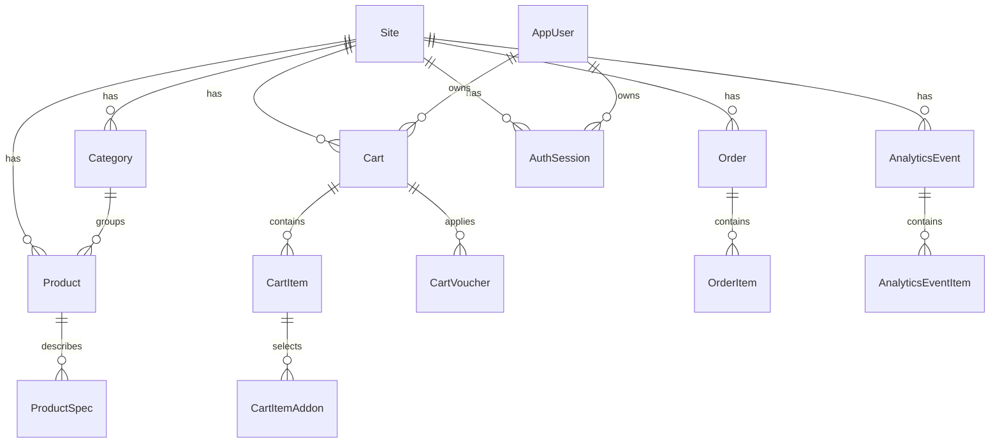

# Project Orange API Technical Documentation

This document is the deep technical reference for the Project Orange API codebase. It is intended for backend maintainers, frontend integrators, QA engineers, and anyone extending the API beyond the high-level setup notes in `README.md`.

## 1. System Overview

Project Orange API is an ASP.NET Core Web API that powers a multi-site ecommerce checkout experience. The backend exposes site-aware product catalog, category, cart, add-on, voucher, shipping, checkout-form, order, authentication, trade-in, geolocation, and analytics endpoints.

The current application is a single ASP.NET Core project:

- Application framework: ASP.NET Core Web API
- Target framework: `.NET 10`
- Persistence: Entity Framework Core with SQL Server
- Identity: ASP.NET Core Identity
- Authentication: JWT bearer validation with the JWT stored in a secure HttpOnly cookie
- Documentation/runtime inspection: Swagger/OpenAPI in development
- CI: GitHub Actions restore and release build

The API is organized as a single ASP.NET Core project with feature-sliced application folders:

```text
HTTP request
  -> ASP.NET Core routing
  -> SiteResolutionMiddleware
  -> Authentication
  -> Authorization
  -> Controller
  -> Feature-owned use-case logic
  -> EF Core DbContext / seed-backed rule tables
  -> SQL Server or in-memory process state
```

Most user-facing ecommerce state is scoped to a resolved site. A request for `ph`, `fr`, `cn`, or `jp` can see different products, categories, feature flags, currencies, checkout forms, shipping rules, orders, carts, auth sessions, and analytics records.

## 2. Repository Layout

```text
.
+-- src/
|   +-- ProjectOrange.Api/
|       +-- Controllers/
|       +-- Application/
|       |   +-- Common/
|       |   |   +-- Authorization/
|       |   |   +-- Exceptions/
|       |   |   +-- Interfaces/
|       |   |   +-- Tenancy/
|       |   +-- Features/
|       |       +-- Analytics/
|       |       +-- Authentication/
|       |       +-- Cart/
|       |       +-- Checkout/
|       |       +-- Fulfillment/
|       |       +-- Geo/
|       |       +-- Options/
|       |       +-- Orders/
|       |       +-- Products/
|       |       +-- Sites/
|       |       +-- TradeIns/
|       +-- Config/
|       +-- Domain/Entities/
|       +-- Infrastructure/
|       |   +-- Middleware/
|       |   +-- Persistence/
|       |   |   +-- Migrations/
|       |   +-- SeedData/
|       +-- Program.cs
|       +-- ProjectOrange.Api.csproj
|       +-- ProjectOrange.Api.http
|       +-- appsettings.json
|       +-- appsettings.Development.json
+-- ProjectOrangeApi.sln
+-- README.md
```

### Important Directory Responsibilities

| Directory | Responsibility |
| --- | --- |
| `src/ProjectOrange.Api/Controllers/` | HTTP route definitions, model binding, auth attributes, response status selection, and feature orchestration. |
| `src/ProjectOrange.Api/Application/Common/` | Shared authorization constants, service interfaces, tenancy context, and structured API errors. |
| `src/ProjectOrange.Api/Application/Features/` | Feature-owned DTOs and use-case logic for products, cart, checkout, orders, fulfillment, analytics, auth, trade-ins, sites, geo, and options. |
| `src/ProjectOrange.Api/Domain/Entities/` | EF Core entity types persisted in SQL Server. |
| `src/ProjectOrange.Api/Infrastructure/Persistence/` | EF Core `AppDbContext`, design-time context factory, and migration history. |
| `src/ProjectOrange.Api/Infrastructure/SeedData/` | Static seed sources for product catalog, sites, options, shipping rules, roles, and test/dev data. |
| `src/ProjectOrange.Api/Infrastructure/Middleware/` | Request pipeline middleware such as site resolution. |
| `src/ProjectOrange.Api/Config/` | Default and site-specific checkout form definitions loaded at runtime by `CheckoutFormService`. |

## 3. Runtime Startup

Application startup is defined in `Program.cs`.

### Service Registration

The API registers:

- MVC controllers with JSON cycle ignoring via `ReferenceHandler.IgnoreCycles`.
- Custom invalid model-state responses through `ApiBehaviorOptions.InvalidModelStateResponseFactory`.
- Swagger/OpenAPI services.
- EF Core SQL Server context using `ConnectionStrings:DefaultConnection`.
- CORS policy named `AllowAngularApp`.
- ASP.NET Core Identity using `AppUser` and `IdentityRole`.
- JWT bearer authentication.
- Authorization policies for every permission in `AppPermissions.All`.
- Application services:
  - `ICartService` -> `CartService`
  - `OrderService`
  - `CheckoutFormService`
  - `ShippingPricingService`
  - `AnalyticsService`
  - `SiteContext`
  - `ISiteContext`
  - `ISiteContextAccessor`
  - `TradeInSessionService` as singleton
  - `GeoCountryService` through `HttpClient`

### Middleware Order

The configured request pipeline is:

```text
UseHttpsRedirection
UseRouting
UseCors("AllowAngularApp")
UseMiddleware<SiteResolutionMiddleware>
UseAuthentication
UseAuthorization
MapControllers
```

This order is important:

1. Routing must run before `SiteResolutionMiddleware` so route values like `{siteCode}` are available.
2. Site resolution must run before authentication because JWT validation verifies that the session site matches the current request site.
3. Authentication must run before authorization.

### Development Behavior

When `ASPNETCORE_ENVIRONMENT=Development`, startup:

- Seeds a development user through `DevelopmentUserSeed.SeedAsync`.
- Enables Swagger and Swagger UI.

Development launch profiles:

| Profile | URL |
| --- | --- |
| `http` | `http://localhost:5175` |
| `https` | `https://localhost:7196;http://localhost:5175` |

Swagger UI is available in development at:

- `http://localhost:5175/swagger`
- `https://localhost:7196/swagger`

## 4. Configuration

The committed `appsettings.json` intentionally keeps the default SQL Server connection string empty:

```json
{
  "ConnectionStrings": {
    "DefaultConnection": ""
  },
  "Logging": {
    "LogLevel": {
      "Default": "Information",
      "Microsoft.AspNetCore": "Warning"
    }
  },
  "AllowedHosts": "*"
}
```

Runtime configuration is expected from `appsettings.Development.json`, user secrets, environment variables, or deployment configuration.

### Required Configuration Keys

| Key | Purpose |
| --- | --- |
| `ConnectionStrings:DefaultConnection` | SQL Server connection string used by EF Core. |
| `Jwt:Issuer` | Expected JWT issuer. |
| `Jwt:Audience` | Expected JWT audience. |
| `Jwt:Key` | Symmetric signing key used for HMAC SHA-256 tokens. Use a long secret. |

### Optional Configuration Keys

| Key | Purpose |
| --- | --- |
| `PasswordReset:ClientResetUrl` | Frontend reset-password URL. Defaults to `http://localhost:4200/reset-password` in development flows if omitted. |

### Environment Variable Names

ASP.NET Core converts double underscores into configuration nesting:

```bash
ConnectionStrings__DefaultConnection="Server=localhost,1433;Database=ProjectOrangeDb;User Id=sa;Password=<password>;TrustServerCertificate=True"
Jwt__Issuer="ProjectOrangeApi"
Jwt__Audience="ProjectOrangeClient"
Jwt__Key="<long-secret>"
PasswordReset__ClientResetUrl="http://localhost:4200/reset-password"
```

### Local Secrets

Prefer .NET user secrets or environment variables for local credentials:

```bash
dotnet user-secrets set "ConnectionStrings:DefaultConnection" "Server=localhost,1433;Database=ProjectOrangeDb;User Id=sa;Password=<password>;TrustServerCertificate=True" --project src/ProjectOrange.Api/ProjectOrange.Api.csproj
dotnet user-secrets set "Jwt:Issuer" "ProjectOrangeApi" --project src/ProjectOrange.Api/ProjectOrange.Api.csproj
dotnet user-secrets set "Jwt:Audience" "ProjectOrangeClient" --project src/ProjectOrange.Api/ProjectOrange.Api.csproj
dotnet user-secrets set "Jwt:Key" "<long-secret>" --project src/ProjectOrange.Api/ProjectOrange.Api.csproj
```

`appsettings.Development.json`, local `.env` variants, and local database files should stay out of source control.

## 5. Local Development Workflow

### Prerequisites

- .NET 10 SDK
- SQL Server
- EF Core CLI tools if applying migrations manually

Install EF Core CLI tools if needed:

```bash
dotnet tool install --global dotnet-ef
```

### Restore, Build, Migrate, Run

```bash
dotnet restore ProjectOrangeApi.sln
dotnet build ProjectOrangeApi.sln
dotnet ef database update --project src/ProjectOrange.Api/ProjectOrange.Api.csproj
dotnet run --project src/ProjectOrange.Api/ProjectOrange.Api.csproj
```

### HTTP Scratch File

`src/ProjectOrange.Api/ProjectOrange.Api.http` contains sample requests for:

- Geo country lookup
- Admin analytics dashboard
- Analytics event ingestion
- Order lookup
- Password reset request
- Password reset completion

The file defaults to:

```http
@ProjectOrangeApi_HostAddress = http://localhost:5175
```

## 6. Multi-Site Architecture

The API supports the following active sites through `SiteSeed`:

| Code | Country | Locale | Currency | Default language | Insurance | Trade-ins | Vouchers | Active |
| --- | --- | --- | --- | --- | --- | --- | --- | --- |
| `ph` | Philippines | `en-PH` | `PHP` | `en` | Yes | Yes | Yes | Yes |
| `fr` | France | `fr-FR` | `EUR` | `fr` | Yes | No | Yes | Yes |
| `cn` | China | `zh-CN` | `CNY` | `zh` | Yes | Yes | Yes | Yes |
| `jp` | Japan | `ja-JP` | `JPY` | `ja` | Yes | Yes | Yes | Yes |

The default site code is `ph`.

### Site Resolution

`SiteResolutionMiddleware` resolves site code for every `/api` request using this priority:

1. Route value: `/api/{siteCode}/...`
2. Header: `X-Site-Code`
3. Query string: `siteCode`
4. Default: `ph`

Examples:

```http
GET /api/jp/products
```

```http
GET /api/products?siteCode=fr
```

```http
GET /api/products
X-Site-Code: cn
```

If the resolved code does not match an active site, the middleware short-circuits with HTTP `404`:

```json
{
  "code": "SITE_NOT_FOUND",
  "message": "Site '<site-code>' is not supported."
}
```

### Site Context

`SiteContext` holds the resolved `Site` entity for the current scoped request and exposes:

- `SiteId`
- `SiteCode`
- `Currency`
- `InsuranceEnabled`
- `TradeInEnabled`
- `VouchersEnabled`
- `Current`

Controllers and services rely on this scoped context instead of repeatedly resolving site state.

### Site-Scoped Routes

Most controllers support both legacy unprefixed and site-prefixed routes:

```text
/api/products
/api/{siteCode}/products
```

`SitesController` is intentionally not site-prefixed:

```text
/api/sites
/api/sites/{code}
```

### Site-Scoped Data

The following persisted models include `SiteId`:

- `Product`
- `Category`
- `Cart`
- `Order`
- `AuthSession`
- `AnalyticsEvent`

Important unique indexes:

- `Site.Code`
- `Category` by `{ SiteId, Name }`
- `Cart` by `{ SiteId, Code }`
- `Order` by `{ SiteId, OrderNumber }`

This means the same cart code, order number, or category name can only collide within the same site.

## 7. Database and Entity Model

The main persistence layer is `AppDbContext`, which inherits from `IdentityDbContext<AppUser>`.

### DbSets

| DbSet | Entity | Purpose |
| --- | --- | --- |
| `Products` | `Product` | Catalog items, stock counts, category relation, item specs. |
| `Categories` | `Category` | Site-scoped product grouping. |
| `Sites` | `Site` | Multi-site configuration and feature flags. |
| `Orders` | `Order` | Order header, customer, payment, shipping, totals, checkout snapshots. |
| `OrderItems` | `OrderItem` | Product snapshots inside orders. |
| `Carts` | `Cart` | Site-scoped shopping cart state. |
| `CartItems` | `CartItem` | Product snapshots inside carts. |
| `CartItemAddons` | `CartItemAddon` | Selected add-on snapshots per cart item. |
| `CartVouchers` | `CartVoucher` | Applied voucher snapshots per cart. |
| `ProductSpecs` | `ProductSpec` | Product specification rows. |
| `AuthSessions` | `AuthSession` | Server-side auth session records backing JWT cookies. |
| `AnalyticsEvents` | `AnalyticsEvent` | Site-scoped analytics events. |
| `AnalyticsEventItems` | `AnalyticsEventItem` | Line items attached to analytics purchase/failure events. |

### Core Relationships



### Snapshot Strategy

The cart and order flows intentionally snapshot product metadata:

- `CartItem` stores product name, price, stock quantity, image URL, category name, subcategory name, and copied item specs.
- `CartItemAddon` stores the selected add-on display metadata and price/credit details.
- `OrderItem` stores product name, price, image URL, category name, subcategory name, item specs, and add-on snapshots so order history remains stable even when catalog data changes.
- `Order.CheckoutDataJson` stores the submitted checkout form data for later review or support flows.

This design favors historical integrity over fully normalized live catalog lookups for completed orders.

### Delete Behavior

Important delete behavior configured in EF:

- Deleting a cart cascades to entries and applied vouchers.
- Deleting a cart item cascades to cart item add-ons.
- Deleting an analytics event cascades to analytics event items.
- Site relationships generally use `DeleteBehavior.Restrict` to prevent accidental deletion of site-owned data.
- User auth sessions cascade when a user is deleted.

## 8. Seed Data

Seed sources live in `src/ProjectOrange.Api/Infrastructure/SeedData`.

### EF-Seeded Data

The following are seeded through `AppDbContext.OnModelCreating`:

- Identity roles from `RoleSeed`
- Sites from `SiteSeed`
- Categories from `CategorySeed`
- Products from `ProductSeed`
- Product specs from `ProductSpecSeed`

### Runtime Rule Seeds

Some domain rules are static in-memory seed tables rather than database tables:

| Seed | Used by | Purpose |
| --- | --- | --- |
| `AddonSeed` | `ProductsController`, `CartService` | Eligible add-ons by product category. |
| `InsurancePlanSeed` | `ProductsController`, `CartService` | Insurance plan options and amounts. |
| `MobilePlanSeed` | `ProductsController`, `CartService` | Mobile plan options and amounts. |
| `VoucherSeed` | `CartService` | Voucher availability, status, discount percent, and minimum subtotal. |
| `FulfillmentOptionSeed` | `ShippingPricingService` | Area-based delivery prices and nearby pickup fulfillment options. |
| `PostalCodeSeed` | `ShippingPricingService` | PH serviceable postal codes. |
| `RegionSeed` | `OptionsController` | PH region options. |
| `CitySeed` | `OptionsController` | PH cities by region. |
| `BarangaySeed` | `OptionsController` | PH barangays by city. |
| `TradeInSeed` | `TradeInsController`, `TradeInSessionService` | Trade-in wizard configuration and option values. |

When changing static runtime seeds, remember that no database migration is needed unless the change also affects EF-seeded data or persisted schema.

## 9. Authentication and Authorization

### Authentication Model

The login flow creates two artifacts:

1. A persisted `AuthSession` row scoped to the current site.
2. A JWT containing user, role, permission, session ID, and site-code claims.

The JWT is written to a secure cookie:

```text
__Host-project-orange-session
```

Cookie options:

- `HttpOnly = true`
- `Secure = true`
- `SameSite = None`
- `Path = /`
- Expiration matches the server-side auth session expiration.

The default session lifetime is two hours.

### JWT Validation

JWT bearer auth reads the token from the session cookie if no bearer token is present. During token validation, the API checks:

- The JWT has a session ID claim.
- The JWT has a user ID claim.
- The JWT has a `site_code` claim.
- The current request site matches the JWT site.
- The corresponding `AuthSession` exists.
- The session belongs to the current site.
- The session belongs to the user.
- The session is not revoked.
- The session has not expired.

This prevents a cookie issued on one site from being reused against another site route.

### Password Reset

Password reset uses ASP.NET Core Identity reset tokens.

- Token lifetime is configured to two hours through `DataProtectionTokenProviderOptions`.
- Tokens are Base64 URL encoded before returning to the client.
- In development, `forgot-password` returns the reset token and reset URL directly to simplify local testing.
- In non-development environments, the endpoint returns only a generic message.
- Successful password reset revokes all active sessions for the user.

### Roles

Known roles:

| Role | Purpose |
| --- | --- |
| `admin` | Full access to all known permissions. |
| `customer` | Default role for registered users. |
| `support-agent` | Support access to products, orders, users, and inventory read. |
| `inventory-manager` | Product and inventory management permissions. |

### Permissions

Known permission claims:

```text
products.read
products.create
products.update
products.delete
orders.read
orders.update
orders.cancel
users.read
users.manage
inventory.read
inventory.update
```

Policies are registered for every permission in `AppPermissions.All`; admin product management uses the product permission policies, while other controllers use public access, `[Authorize]`, or admin role checks as appropriate.

### Role Permission Mapping

| Role | Permissions |
| --- | --- |
| `admin` | All permissions. |
| `customer` | `products.read`, `orders.read`, `orders.cancel`. |
| `support-agent` | `products.read`, `orders.read`, `orders.update`, `orders.cancel`, `users.read`, `inventory.read`. |
| `inventory-manager` | `products.read`, `products.create`, `products.update`, `products.delete`, `orders.read`, `inventory.read`, `inventory.update`. |

Users with no known role are normalized to `customer`.

## 10. API Route Reference

Unless otherwise noted, endpoints support both:

```text
/api/<resource>
/api/{siteCode}/<resource>
```

### Site Discovery

| Method | Route | Auth | Description |
| --- | --- | --- | --- |
| `GET` | `/api/sites` | Public | Lists active sites. |
| `GET` | `/api/sites/{code}` | Public | Gets one active site by code. |

### Catalog

| Method | Route | Auth | Description |
| --- | --- | --- | --- |
| `GET` | `/api/products` | Public | Lists products for the resolved site. Supports search, filters, and sorting. |
| `GET` | `/api/products/search/suggestions?query=` | Public | Returns up to five relevance-ranked catalog search terms for autocomplete. |
| `GET` | `/api/products/{id}` | Public | Gets one product by ID for the resolved site. |
| `GET` | `/api/products/{id}/addons` | Public | Lists eligible add-ons for a product category and current site feature flags. |
| `GET` | `/api/products/{id}/insurance-plans` | Public | Lists insurance plans if insurance is enabled for the site. |
| `GET` | `/api/products/{id}/mobile-plans` | Public | Lists mobile plans eligible for the product category. |
| `GET` | `/api/admin/products` | `products.read` | Lists products for admin management. Supports filters and sorting. |
| `GET` | `/api/admin/products/{id}` | `products.read` | Gets one product with specs, options, and variants. |
| `POST` | `/api/admin/products` | `products.create` | Creates a site-scoped product. |
| `PUT` | `/api/admin/products/{id}` | `products.update` | Updates a product and replaces specs, options, and variants. |
| `DELETE` | `/api/admin/products/{id}` | `products.delete` | Deletes a product if it is not referenced by carts or orders. |
| `GET` | `/api/categories` | Public | Lists categories for the resolved site. |
| `POST` | `/api/categories` | Public | Creates a category scoped to the resolved site. |

Product query parameters:

| Parameter | Type | Description |
| --- | --- | --- |
| `categoryId` | integer | Filters products by category ID. |
| `sortBy` | string | Supports `price-asc`, `price-desc`, `name-asc`, `name-desc`; defaults to ID ordering. |
| `minPrice` | decimal | Minimum product price. |
| `maxPrice` | decimal | Maximum product price. |
| `search` | string | Matches product names, descriptions, categories, and subcategories. Results default to relevance ordering unless `sortBy` is supplied. |

Product responses include:

- `id`
- `name`
- `description`
- `price`
- `reviewRating`
- `stockQuantity`
- `imageUrl`
- `categoryId`
- `categoryName`
- `itemSpecs`
- `availableColors`

### Cart

| Method | Route | Auth | Description |
| --- | --- | --- | --- |
| `GET` | `/api/carts/{cartCode}` | Public or cookie-aware | Gets a cart if it is anonymous or belongs to the current user. |
| `GET` | `/api/carts/{cartCode}/recommended-products` | Public or cookie-aware | Gets relevant in-stock accessory recommendations for the cart. |
| `GET` | `/api/carts/me` | Required | Gets the current user's cart. |
| `POST` | `/api/carts/items` | Public or cookie-aware | Creates or reuses a cart and adds an item. |
| `POST` | `/api/carts/{cartCode}/items` | Public or cookie-aware | Adds an item to an existing cart. |
| `PUT` | `/api/carts/{cartCode}/items/{productId}` | Public or cookie-aware | Updates quantity; quantity `<= 0` removes the item. |
| `DELETE` | `/api/carts/{cartCode}/items/{productId}` | Public or cookie-aware | Removes an item. |
| `PUT` | `/api/carts/{cartCode}/items/{productId}/addons/{addonId}` | Public or cookie-aware | Adds or replaces one add-on snapshot for an item. |
| `DELETE` | `/api/carts/{cartCode}/items/{productId}/addons/{addonId}` | Public or cookie-aware | Removes one add-on from an item. |
| `POST` | `/api/carts/{cartCode}/vouchers` | Public or cookie-aware | Applies a voucher to a cart. |
| `DELETE` | `/api/carts/{cartCode}/vouchers/{voucherCode}` | Public or cookie-aware | Removes an applied voucher. |
| `PUT` | `/api/carts/{cartCode}/shipping` | Public or cookie-aware | Stores selected shipping method and price on the cart. |

Add to cart request:

```json
{
  "productId": 1,
  "quantity": 1,
  "addons": [
    {
      "id": "insurance",
      "isAdded": true
    }
  ],
  "insurancePlanCode": "screen-protection",
  "mobilePlanCode": null,
  "tradeInSessionId": null
}
```

Update quantity request:

```json
{
  "quantity": 2
}
```

Apply voucher request:

```json
{
  "code": "ORANGE10"
}
```

Update shipping request:

```json
{
  "postalCode": "1000",
  "shippingMethodCode": "standard"
}
```

Cart response shape:

```json
{
  "code": "CART-XXXXXXXX",
  "entries": [
    {
      "productId": 1,
      "productName": "iPhone 15",
      "price": 59999,
      "quantity": 1,
      "totalPrice": 59999,
      "categoryName": "Phones",
      "subcategoryName": "Flagship"
    }
  ],
  "appliedVouchers": [],
  "cartSummary": [
    {
      "name": "Subtotal",
      "amount": 59999,
      "billingFrequency": "",
      "displayValue": null
    },
    {
      "name": "Shipping",
      "amount": null,
      "billingFrequency": "",
      "displayValue": "To be calculated"
    },
    {
      "name": "Total",
      "amount": 59999,
      "billingFrequency": "",
      "displayValue": null
    }
  ]
}
```

### Checkout and Address Options

| Method | Route | Auth | Description |
| --- | --- | --- | --- |
| `GET` | `/api/checkout/form` | Public | Returns site-specific checkout form JSON with fallback to default config. |
| `GET` | `/api/options/regions?search=` | Public | Returns PH regions for `ph`; empty list for non-PH sites. |
| `GET` | `/api/options/cities?parent=&search=` | Public | Returns PH cities for a region; empty list for non-PH sites or missing parent. |
| `GET` | `/api/options/barangays?parent=&search=` | Public | Returns PH barangays for a city; empty list for non-PH sites or missing parent. |
| `GET` | `/api/postal-codes/validate?postalCode=` | Public | Validates serviceability for the current site. |
| `GET` | `/api/fulfillment/options?postalCode=` | Public | Returns postal-code-priced delivery and nearby pickup fulfillment options; `/api/shipping/options` remains an alias. |

Checkout form resolution:

1. `Config/sites/{siteCode}/checkout-form.json`
2. `Config/checkout-form.json`
3. `404` if neither file exists

### Orders

| Method | Route | Auth | Description |
| --- | --- | --- | --- |
| `GET` | `/api/orders` | Public | Lists all orders for the current site. |
| `GET` | `/api/orders/lookup?orderNumber=&email=` | Public | Looks up an order by number and matching customer email. |
| `GET` | `/api/orders/{orderNumber}` | Public | Gets one order by order number, or numeric legacy ID if parseable. |
| `POST` | `/api/orders` | Public | Places an order from a cart snapshot or legacy item list. |

Order creation supports two input styles:

1. Preferred cart snapshot:

```json
{
  "cart": {
    "code": "CART-XXXXXXXX",
    "entries": [],
    "appliedVouchers": [],
    "cartSummary": []
  },
  "checkoutData": {
    "customer": {
      "firstName": "Juan",
      "lastName": "Dela Cruz",
      "email": "juan@example.com"
    },
    "delivery": {
      "addressLine1": "123 Orange Avenue",
      "city": "Manila",
      "postalCode": "1000",
      "country": "Philippines"
    },
    "payment": {
      "paymentMethod": "card"
    },
    "shipping": {
      "shippingMethod": "standard"
    }
  }
}
```

2. Legacy item list:

```json
{
  "customerName": "Juan Dela Cruz",
  "customerEmail": "juan@example.com",
  "items": [
    {
      "productId": 1,
      "quantity": 1
    }
  ]
}
```

Order rules:

- At least one item is required.
- Quantity must be greater than zero.
- Product IDs must exist in the current site.
- Stock is validated and decremented during order placement.
- Order creation runs in a database transaction.
- Order numbers are generated as `OR-yyyyMMdd-random4`, with a GUID fallback after repeated collisions.
- `cod` payment method yields `paymentStatus = pending` and `orderStatus = pending_payment`.
- Other payment methods yield `paymentStatus = paid` and `orderStatus = confirmed`.
- Delivery estimates are derived from the shipping method:
  - `express`: `1-2 business days`
  - `free`: `5-7 business days`
  - default: `3-5 business days`

### Authentication

| Method | Route | Auth | Description |
| --- | --- | --- | --- |
| `POST` | `/api/auth/register` | Public | Creates a user and assigns the `customer` role. |
| `POST` | `/api/auth/login` | Public | Validates credentials, creates site-scoped auth session, writes session cookie. |
| `POST` | `/api/auth/forgot-password` | Public | Creates a password reset token if user exists, but always returns a generic message. |
| `POST` | `/api/auth/reset-password` | Public | Resets password and revokes active sessions. |
| `GET` | `/api/auth/session` | Required | Returns the active session profile. |
| `POST` | `/api/auth/logout` | Cookie-aware | Revokes the current session if present and clears cookie. |
| `GET` | `/api/auth/me` | Required | Returns the current user profile. |

Register request:

```json
{
  "fullName": "Juan Dela Cruz",
  "email": "juan@example.com",
  "password": "Passw0rd!"
}
```

Login request:

```json
{
  "email": "juan@example.com",
  "password": "Passw0rd!"
}
```

Auth response:

```json
{
  "user": {
    "id": "<identity-user-id>",
    "email": "juan@example.com",
    "fullName": "Juan Dela Cruz",
    "roles": ["customer"],
    "permissions": ["orders.cancel", "orders.read", "products.read"]
  },
  "session": {
    "id": "<session-id>",
    "createdAtUtc": "2026-06-20T00:00:00+00:00",
    "expiresAtUtc": "2026-06-20T02:00:00+00:00"
  }
}
```

### Trade-Ins

| Method | Route | Auth | Description |
| --- | --- | --- | --- |
| `GET` | `/api/trade-ins/config` | Public | Returns trade-in config if enabled for the site. |
| `GET` | `/api/trade-ins/categories` | Public | Returns trade-in categories if enabled. |
| `GET` | `/api/trade-ins/brands?categoryCode=` | Public | Returns trade-in brands. |
| `GET` | `/api/trade-ins/devices?categoryCode=&brandCode=` | Public | Returns trade-in devices. |
| `GET` | `/api/trade-ins/storages?deviceCode=` | Public | Returns storage options. |
| `POST` | `/api/trade-in-sessions` | Public | Creates an in-memory trade-in session. |
| `GET` | `/api/trade-in-sessions/{sessionId}` | Public | Gets a site-matching session. |
| `PATCH` | `/api/trade-in-sessions/{sessionId}/step-one` | Public | Updates step one data and summary. |
| `PATCH` | `/api/trade-in-sessions/{sessionId}/step-two` | Public | Updates step two data. |
| `PATCH` | `/api/trade-in-sessions/{sessionId}/step-three` | Public | Updates step three answers. |
| `PATCH` | `/api/trade-in-sessions/{sessionId}/confirm` | Public | Marks the session confirmed. |

Trade-in behavior:

- Disabled sites return `404` for all trade-in endpoints.
- `fr` has trade-ins disabled in seed data.
- Sessions are stored in memory by the singleton `TradeInSessionService`.
- Sessions are lost when the process restarts.
- Sessions are site-scoped. A session created for `ph` cannot be read or attached from `jp`.
- A trade-in add-on can only be added to cart after the session is confirmed and has a positive final amount.

### Analytics

| Method | Route | Auth | Description |
| --- | --- | --- | --- |
| `POST` | `/api/analytics/events` | Public | Accepts analytics event payloads and returns the dashboard snapshot. |
| `GET` | `/api/admin/analytics/dashboard?site=&period=` | Admin role | Returns analytics dashboard for the selected site and period. |

Supported event types:

```text
visitor
product_view
add_to_cart
checkout_start
purchase
payment_failure
```

Supported dashboard periods:

```text
last-7-days
past-month
past-year
from-start
```

If an unknown period is supplied, the service normalizes to `last-7-days`.

Example event payload:

```json
{
  "type": "purchase",
  "id": "event-123",
  "occurredAt": "2026-06-20T00:00:00Z",
  "visitorId": "visitor-123",
  "sessionId": "session-123",
  "orderNumber": "OR-20260620-1234",
  "value": 59999,
  "items": [
    {
      "productId": 1,
      "productName": "iPhone 15",
      "categoryName": "Phones",
      "price": 59999,
      "quantity": 1
    }
  ]
}
```

Analytics ingestion accepts either a single event object or a payload containing events, depending on the normalization helper inside `AnalyticsService`. Invalid event types are ignored. Duplicate event IDs are ignored. Duplicate purchase events for the same site and order number are also ignored.

Dashboard response includes:

- Visitor count
- Product views
- Add-to-cart count
- Checkout starts
- Purchase count
- Revenue
- Average order value
- Add-to-cart rate
- Checkout-start rate
- Purchase conversion rate
- Cart abandonment rate
- Payment failure count and rate
- Units sold
- Daily or monthly trend points
- Funnel steps
- Top products
- Top categories
- Purchase order summaries
- Payment failure summaries

### Geolocation

| Method | Route | Auth | Description |
| --- | --- | --- | --- |
| `GET` | `/api/geo/country` | Public | Returns a two-letter country code if it can be inferred. |

Country detection order:

1. Edge/provider country headers such as `CF-IPCountry`, `X-Vercel-IP-Country`, `CloudFront-Viewer-Country`, and similar.
2. Public client IP from forwarding headers.
3. Public remote IP address.
4. External lookup through `https://ipapi.co/{ip}/country/`.

Private, loopback, unknown, invalid, or unparseable IP values are ignored. Lookup failures return `null` rather than failing the request.

## 11. Business Rule Details

### Catalog and Add-ons

Products are site-scoped and returned with category and item specs. Add-ons are not stored on products in the database; instead, `AddonSeed` defines add-on definitions and eligible categories.

Feature-flagged add-ons:

- `insurance` is hidden when `InsuranceEnabled` is false.
- `trade-in` is hidden when `TradeInEnabled` is false.
- Other add-ons are available if eligible for the category.

Insurance and mobile plan prices are defined in PHP in seed data and converted to the active site's currency through `SiteCurrency`.

### Cart Ownership

Cart lookup is site-scoped and user-aware:

- Anonymous carts have `UserId = null`.
- Authenticated users get or create a user-owned cart.
- If an authenticated user adds to an existing anonymous cart, the cart is claimed by that user.
- A user cannot access another user's cart through `cartCode`.

Cart code format:

```text
CART-XXXXXXXX
```

The code is generated from an uppercase GUID string and truncated to 13 characters.

### Cart Item Merging

When adding a product already in the cart:

- If selected add-ons match the existing add-on snapshots, quantity is incremented.
- If selected add-ons differ, the service rejects the operation with `ADDON_LIMIT_REACHED`.

This avoids ambiguous line items where the same product ID would represent multiple different add-on bundles.

### Add-on Snapshot Rules

The service snapshots add-on choices into `CartItemAddon`.

Add-on types:

| Add-on | Required selection | Amount behavior |
| --- | --- | --- |
| `insurance` | `insurancePlanCode` | Positive one-time amount, multiplied by quantity. |
| `mobile-plan` | `mobilePlanCode` | Monthly amount, not included in one-time subtotal. |
| `trade-in` | confirmed `tradeInSessionId` | Negative credit, not multiplied by quantity. |
| Display-only add-on | none | No amount unless populated by the mapped type. |

`CartSummary` includes:

- Subtotal
- One-time add-on amounts
- Shipping
- Discount if present
- Total

Monthly add-ons are represented with a billing frequency and are not added to the one-time total.

### Vouchers

Voucher rules come from `VoucherSeed`.

Validation rules:

- Site must have vouchers enabled.
- Voucher code is normalized to uppercase.
- Code must be between 3 and 32 characters.
- Code may contain letters, numbers, hyphens, and underscores.
- Cart must contain at least one item.
- Voucher must exist.
- Voucher must be active.
- Current time must be within optional start and expiration bounds.
- Subtotal must satisfy the converted site-currency minimum subtotal.
- The same voucher cannot be applied twice.
- Only one voucher can be applied to a cart at a time.

Discount calculation:

```text
discount = subtotal * (discountPercent / 100)
discount = min(discount, subtotal)
```

### Shipping

Postal-code validation is site-specific:

| Site | Validation rule |
| --- | --- |
| `ph` | Postal code must be in `PostalCodeSeed`. |
| `fr` | Exactly five digits. |
| `cn` | Exactly six digits. |
| `jp` | Exactly seven digits after removing hyphens. |

Fulfillment options:

- delivery prices and availability estimates are selected by site/country postal-code area rules.
- pickup options include local pickup location metadata and are filtered to nearby stores.
- postal code is optional for the options endpoint; omitting it returns the current site's default country-local options.
- unsupported or unserviceable postal codes return an empty list when supplied.

### Checkout Form Configuration

Checkout form DTO supports:

- Version
- Steps
- Fields
- Nested fields
- Validators
- Async validators
- Grid layout hints
- Options API paths
- Dependency fields
- Visibility rules
- Inline field options

Site-specific form JSON allows the frontend to render different address, payment, shipping, or localization experiences without changing C# code.

### Orders

Order placement creates durable snapshots from either:

- `CartResponseDto.Entries`, or
- legacy `Items` with product ID and quantity.

When cart entries are used, the service trusts cart item display data where available but validates product existence and stock against the database. Product stock is decremented before save.

Order totals:

- If cart summary contains a `Total` row, that value is used.
- Otherwise, total falls back to sum of `price * quantity`.

Customer and shipping fields are resolved from:

1. Explicit `customerName` and `customerEmail` request fields.
2. `checkoutData` customer, delivery, payment, and shipping groups.
3. Defaults used as compatibility fallbacks.

### Trade-In Sessions

Trade-in sessions are currently process-local. This is suitable for demos and short local flows, but production deployments with multiple instances or restarts should move this state into a durable store.

Concurrency is handled by a lock around the in-memory dictionary. The dictionary key is `sessionId`; site validation is performed on every lookup/update.

### Analytics

Analytics event storage is durable and site-scoped. The service computes dashboard metrics in memory after loading relevant events from the database.

Deduplication rules:

- Duplicate event IDs are ignored.
- Duplicate purchase events for the same `{ SiteId, OrderNumber }` are ignored.
- Duplicates within the same incoming batch are also ignored.

Indexes support common dashboard queries:

- `{ SiteId, Type, OccurredAt }`
- filtered `{ SiteId, OrderNumber }` for purchase events with non-null order numbers

## 12. Error Handling

Cart, voucher, add-on, and order domain failures are represented by `ApiErrorException` subclasses. Controllers translate these exceptions into `ProblemDetails`.

Common problem response shape:

```json
{
  "type": "https://project-orange-api/errors/CODE",
  "title": "Error title",
  "status": 400,
  "detail": "Human-readable detail.",
  "code": "ERROR_CODE"
}
```

Known domain error codes:

| Code | Typical status | Meaning |
| --- | --- | --- |
| `ADDON_LIMIT_REACHED` | `400` | Attempted unsupported add-on combination or duplicate behavior. |
| `ADDON_NOT_AVAILABLE` | `400` | Selected add-on or option is unavailable for product/site. |
| `CART_ITEM_NOT_FOUND` | `404` | Product line does not exist in the cart. |
| `CART_NOT_FOUND` | `404` | Cart does not exist, belongs to another site, or belongs to another user. |
| `ORDER_INSUFFICIENT_STOCK` | `409` | Product stock is lower than requested quantity. |
| `ORDER_INVALID_REQUEST` | `400` | Order payload is invalid. |
| `ORDER_PRODUCT_NOT_FOUND` | `404` | Order references a product unavailable for the current site. |
| `VOUCHER_ALREADY_APPLIED` | `409` | Voucher is already on the cart. |
| `VOUCHER_CODE_INVALID_FORMAT` | `400` | Voucher code failed format validation. |
| `VOUCHER_LIMIT_REACHED` | `409` | Cart already has a voucher. |
| `VOUCHER_MINIMUM_SUBTOTAL_NOT_MET` | `400` | Cart subtotal is below voucher minimum. |
| `VOUCHER_NOT_APPLICABLE` | `400` | Voucher is unavailable, disabled, expired, scheduled, or otherwise invalid. |

Automatic model-state validation failures return:

- `REQUEST_VALIDATION_FAILED` for most endpoints.
- `VOUCHER_CODE_INVALID_FORMAT` for cart voucher endpoints.

## 13. Security Notes

### Current Strengths

- HttpOnly secure session cookie.
- Server-side auth session validation.
- Session revocation support.
- Site-code claim binding to current request site.
- Password reset token expiry.
- Generic forgot-password response.
- CORS limited to `http://localhost:4200` in current configuration.
- SQL queries go through EF Core LINQ rather than raw SQL.

### Review Before Production

Review these areas before production deployment:

- Ensure `Jwt:Key` is high entropy and never committed.
- Ensure HTTPS termination is enforced end to end.
- Configure production CORS origins.
- Add authorization to currently public write endpoints if admin/customer separation is required.
- Move `TradeInSessionService` state to durable/shared storage if running more than one instance.
- Add email delivery for password reset outside development.
- Consider request rate limiting for auth, voucher, analytics, and order endpoints.
- Add observability for auth failures, order placement, stock conflicts, and analytics ingestion drops.
- Decide whether `GET /api/orders` and `GET /api/orders/{orderNumber}` should require auth or support-only access.
- Decide whether `POST /api/categories` should require an admin or inventory permission.

## 14. CI and Quality Gates

GitHub Actions workflow: `.github/workflows/ci.yml`

Triggers:

- Push to `develop`
- Push to `main`
- Pull request targeting `develop`
- Pull request targeting `main`

Build job:

```text
checkout
setup-dotnet 10.0.x
dotnet restore ProjectOrangeApi.sln
dotnet build ProjectOrangeApi.sln --configuration Release --no-restore
```

The repository includes `tests/ProjectOrangeApi.Tests` for unit and endpoint-level coverage. Recommended next coverage areas are:

- Unit tests for `CartService` voucher/add-on/shipping summary rules.
- Unit tests for `OrderService` stock validation and total calculation.
- Unit tests for `SiteResolutionMiddleware` resolution precedence.
- Unit tests for `ShippingPricingService` site-specific postal validation.
- Integration tests for auth session site binding.
- Integration tests for site-scoped catalog/cart/order isolation.

## 15. Extension Guides

### Add a New Site

1. Add a new `Site` entry in `SiteSeed`.
2. Add localized categories/products/specs in `CategorySeed`, `ProductSeed`, and `ProductSpecSeed`.
3. Add `Config/sites/{siteCode}/checkout-form.json`.
4. Add shipping validation/rates in `ShippingPricingService` or seed-backed rules.
5. Confirm feature flags for insurance, trade-ins, and vouchers.
6. Add migration if seeded EF data changed.
7. Verify:
   - `GET /api/sites`
   - `GET /api/{siteCode}/products`
   - `GET /api/{siteCode}/checkout/form`
   - cart, voucher, shipping, auth session, and order flows.

### Add a Product

1. Add product row to `ProductSeed`.
2. Add any specs to `ProductSpecSeed`.
3. Ensure category ID is correct for each site.
4. Add or verify image URL.
5. Add migration for EF seed data changes.
6. Verify product list, product detail, cart add, and order placement.

### Add an Add-on Type

1. Add definition to `AddonSeed`.
2. Decide eligible categories.
3. Add response mapping if the product add-on list needs extra fields.
4. Extend `CartService.CreateCartItemAddonSnapshot` if the add-on has special pricing or selection requirements.
5. Update `CartService.GetAddonSummary` behavior if it affects totals.
6. Add tests for cart add, replace, remove, and summary behavior.

### Add a Voucher

1. Add voucher rule to `VoucherSeed`.
2. Set status, discount percent, optional time window, and minimum subtotal.
3. Remember minimum subtotal is treated as a PHP amount and converted for other currencies.
4. Verify apply/remove on each enabled site.

### Add an Auth-Protected Endpoint

1. Add `[Authorize]` or a role/policy-specific authorize attribute.
2. If permission-based, use an existing permission constant or add a new one to `AppPermissions`.
3. Add the permission to `AppPermissions.All`.
4. Update `RolePermissionMap`.
5. Ensure JWTs include the claim by logging in after the change.
6. Add integration coverage for anonymous, wrong-role, and allowed-role requests.

### Add an Analytics Event Type

1. Add constant to `AnalyticsEventTypes`.
2. Add it to `AnalyticsEventTypes.All`.
3. Update normalization and dashboard aggregation if the event contributes to metrics.
4. Add database indexes if query patterns change.
5. Update frontend tracking and this documentation.

## 16. Operational Notes

### Migrations

Create a migration:

```bash
dotnet ef migrations add <MigrationName> --project src/ProjectOrange.Api/ProjectOrange.Api.csproj --output-dir Infrastructure/Persistence/Migrations
```

Apply migrations:

```bash
dotnet ef database update --project src/ProjectOrange.Api/ProjectOrange.Api.csproj
```

The design-time factory reads:

1. `appsettings.json`
2. `appsettings.{ASPNETCORE_ENVIRONMENT}.json`
3. Environment variables

If `ConnectionStrings:DefaultConnection` is missing or blank, design-time EF operations fail with:

```text
Connection string 'DefaultConnection' is not configured.
```

### Currency Conversion

`SiteCurrency` converts PHP seed amounts to the active site's currency for insurance, mobile plans, trade-in credits, and voucher minimum subtotals. Treat PHP as the canonical seed amount unless the currency conversion helper is redesigned.

### CORS

Current CORS policy allows:

```text
http://localhost:4200
```

It allows any header, any method, and credentials. Production deployments should replace or externalize this origin list.

### External Network Dependency

`GeoCountryService` may call:

```text
https://ipapi.co/{ip}/country/
```

The HTTP client timeout is two seconds. Lookup errors are swallowed and return `null`.

### In-Memory State

`TradeInSessionService` stores sessions in memory. This state is:

- Not persisted to SQL Server.
- Not shared across instances.
- Lost on application restart.

Use a persistent table or distributed cache if trade-in sessions must survive deployment, restart, or horizontal scaling.

## 17. Frontend Integration Notes

### Always Pass Site Context

Prefer site-prefixed URLs for clarity:

```text
/api/ph/products
/api/fr/products
/api/cn/products
/api/jp/products
```

This is safer than relying on query strings or headers because routes make site context visible in logs, browser tools, and copied URLs.

### Use Credentialed Requests for Auth

The backend stores the JWT in an HttpOnly cookie. Browser clients should make credentialed requests when using auth endpoints:

```ts
fetch("/api/ph/auth/session", {
  credentials: "include"
});
```

Because the cookie is `Secure` and `SameSite=None`, HTTPS should be used for browser testing of cookie auth flows.

### Cart Flow

Recommended frontend cart sequence:

1. Fetch product and optional add-ons/plans.
2. If trade-in is selected, complete and confirm a trade-in session.
3. Add product with selected add-on codes.
4. Store returned cart code.
5. Validate postal code.
6. Fetch shipping options.
7. Save selected shipping option on the cart.
8. Apply voucher if desired.
9. Submit order with the final cart snapshot and checkout data.

### Checkout Form

The frontend should treat checkout form JSON as configuration, not as server-side validation guarantees. Server-side order placement still performs product, stock, and site validation, but field-level checkout validation mostly lives in the client-rendered form definition.

## 18. Maintainer Checklist

Before merging backend changes, check:

- Does the change preserve site scoping?
- Does auth/session behavior still bind to the current site?
- Are new persisted fields included in migrations?
- Are seed changes reflected in migrations if EF-seeded?
- Are public write endpoints intentionally public?
- Are cart/order snapshots still backward compatible?
- Are error codes stable for frontend handling?
- Does Swagger still start in development?
- Does `dotnet build ProjectOrangeApi.sln --configuration Release` pass?
- Does the frontend need documentation updates for new request/response shapes?
