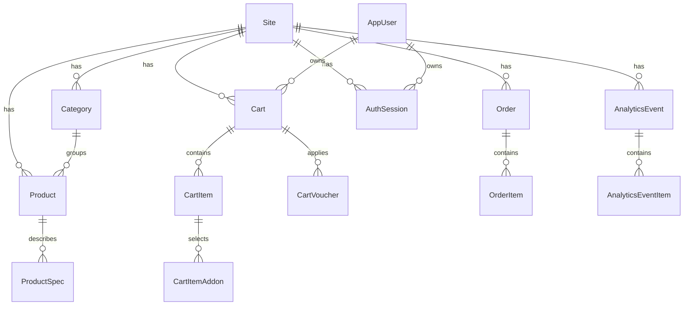

# 7. Database and Entity Model

The main persistence layer is `AppDbContext`, which inherits from `IdentityDbContext<AppUser>`.

## DbSets

| DbSet | Entity | Purpose |
| --- | --- | --- |
| `Products` | `Product` | Catalog items, stock counts, category relation, item specs. |
| `Categories` | `Category` | Site-scoped product grouping. |
| `Sites` | `Site` | Multi-site configuration and feature flags. |
| `Orders` | `Order` | Order header, customer, payment, shipping, totals, checkout snapshots. |
| `OrderItems` | `OrderItem` | Product snapshots inside orders. |
| `Carts` | `Cart` | Site-scoped shopping cart state. |
| `CartItems` | `CartItem` | Product snapshots inside carts. |
| `CartItemAddons` | `CartItemAddon` | Selected add-on snapshots per cart item. |
| `CartVouchers` | `CartVoucher` | Applied voucher snapshots per cart. |
| `ProductSpecs` | `ProductSpec` | Product specification rows. |
| `AuthSessions` | `AuthSession` | Server-side auth session records backing JWT cookies. |
| `AnalyticsEvents` | `AnalyticsEvent` | Site-scoped analytics events. |
| `AnalyticsEventItems` | `AnalyticsEventItem` | Line items attached to analytics purchase/failure events. |

## Core Relationships

## Snapshot Strategy

The cart and order flows intentionally snapshot product metadata:

- `CartItem` stores product name, price, stock quantity, image URL, category name, subcategory name, and copied item specs.
- `CartItemAddon` stores the selected add-on display metadata and price/credit details.
- `OrderItem` stores product name, price, image URL, category name, subcategory name, item specs, and add-on snapshots so order history remains stable even when catalog data changes.
- `Order.CheckoutDataJson` stores the submitted checkout form data for later review or support flows.

This design favors historical integrity over fully normalized live catalog lookups for completed orders.

## Delete Behavior

Important delete behavior configured in EF:

- Deleting a cart cascades to entries and applied vouchers.
- Deleting a cart item cascades to cart item add-ons.
- Deleting an analytics event cascades to analytics event items.
- Site relationships generally use `DeleteBehavior.Restrict` to prevent accidental deletion of site-owned data.
- User auth sessions cascade when a user is deleted.
